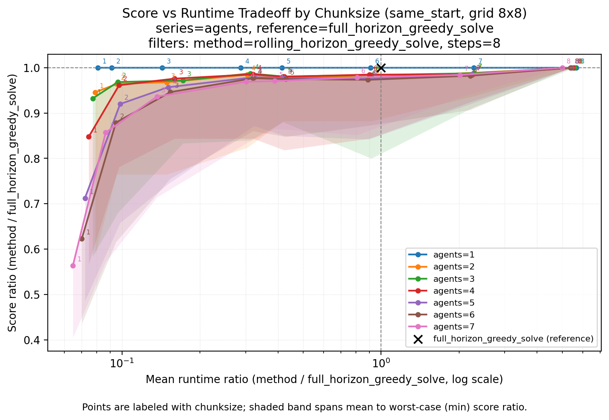

# multi-agent-coverage-planner

A benchmark for **rolling-horizon (receding-horizon) coverage path planning** on a
multi-agent grid. Agents are allocated paths to maximize joint grid coverage under a
submodular objective; the package compares full-horizon sequential greedy against a
chunked rolling-horizon variant (and an optional exhaustive baseline) across
configurable sweeps of grid size, agent count, and planning horizon. Per-run results
are persisted to SQLite and visualized as heatmaps, score-vs-runtime scatters, and
Pareto tradeoff curves from a single CLI.



**Headline result (8×8 grid, 8-step paths, 1–7 agents):** planning in chunks of 3–4
steps recovers ~97–99% of full-horizon greedy coverage on average at a 2.5–10×
runtime reduction, while fully myopic single-step planning gives up ~44% of coverage
on average in the 7-agent case (worse still in the worst case). The knee of the
tradeoff sits at intermediate chunk sizes.

## Question

In multi-agent path planning, how much coverage score do we trade — and how much
runtime do we save — by planning over a rolling horizon instead of the full horizon?

## Why a rolling horizon?

Full-horizon planning requires each agent to commit to its entire path in one
decision. Since the number of candidate paths grows exponentially in path length
(branching factor ≈ 3–4 per step), full-horizon planning becomes expensive quickly. A
rolling horizon instead plans the path in chunks of `d < D` steps, carrying coverage
state between rounds: enumeration cost per round drops from O(b^D) to O(b^d), at the
price of myopia — an agent cannot see value that lies more than `d` steps ahead. This
benchmark quantifies that price empirically.

## Problem Structure

We have $K$ identical agents on a square grid. The goal is the maximize the total coverage of the grid given the following constraints:

- A set path length for each agent
- The grid is comprised of discrete integer coordinates
- Each coordinate is worth 1 point, with overlapping providing no extra benefit
- Agents choose sequentially, with full past information but no consideration of other agent preferences

> [!NOTE]
> **Scope.** Currently, we only consider the case where all agents share the same initial position.

### Objective

We seek paths such that the coverage of the grid is maximized. More explicitly, we follow an expansion of Nemhauser et al.'s submodular set maximization problem.

Let:

- $K$ be the number of agents, where $`\text{agent}_{k}`$ chooses before $`\text{agent}_{k+1}`$ for $1 \le k < K$.
- $D$ be the length of the path to be selected (same for all agents).
- $\Omega$ be an $m \times n$ utility matrix, where:
    - $m$ is the number of possible grid locations.
    - $n$ is the cumulative number of paths of length $D$ available to any agent.
    - $\mathcal{C}$ is the row index set (encodes all coordinates).
    - $\mathcal{P}$ is the column index set (encodes all possible paths).
    - $`\omega_{cp} \in \Omega`$ with $c \in \mathcal{C}$ and $p \in \mathcal{P}$.
- $`\mathcal{P}_k \subseteq \mathcal{P}`$ contains the indices for all available paths for $`\text{agent}_{k}`$.
- $`S_{k-1} \subseteq \mathcal{P}`$ contains the path indices of all previous allocations at sequential choice $k$.
- $\text{Coverage}(S)$ encodes the utility score of a selection of paths. Let $I$ be the set of row indices, where each row represents a possible location to visit:

$$
\text{Coverage}(S) = \sum_{c \in \mathcal{C}} \max_{p \in S}\lbrace \omega_{cp} \rbrace.
$$

- $`e \in \mathcal{P}_k`$ is a possible path for $`\text{agent}_{k}`$, with $`e_k`$ marking the final path for agent $k$. The selection is based on maximizing marginal gain:

$$
e_k \in \arg\max_{e \in \mathcal{P}_k} \Big\lbrace \text{Coverage}\big(S_{k-1} \cup \lbrace e \rbrace\big) - \text{Coverage}(S_{k-1}) \Big\rbrace,
$$

with $`e_k`$ found prior to $`e_{k+1}`$.

Thus, our objective is selecting paths to maximize coverage:

$$
\max_{e \in \mathcal{P}} \text{Coverage}\bigg[\bigcup_{k=1}^{K} \lbrace e_k \rbrace\bigg].
$$

> [!NOTE]
> For clarification, here is a sample of a possible $\Omega$ coordinate-path utility matrix:

$$
\Omega =
\begin{array}{c|cccc}
       & p=0 & p=1 & \cdots & p=n \cr
\hline
(0,0)  & 1   & 0   & \cdots & 0   \cr
(0,1)  & 0   & 1   & \cdots & 1   \cr
(0,2)  & 1   & 1   & \cdots & 0   \cr
\vdots & \vdots & \vdots & \ddots & \vdots
\end{array}
$$

## Methods

The above structure outlines the full-horizon greedy approach, maximizing marginal utility of path coverage for all agents, iterating over all paths of length $D$ available to that agent. This increases exponentially as $D$ increases.

We attempt to divide the problem into rounds: instead of $`e_k`$ encoding a path of length $D$, we provide a smaller, maximum "chunk size" each round will plan for. Given some chunk size $0 < d < D$, partial paths are planned in much the same manner as the full paths, with each round carrying over all previously chosen path indices. If $d \mid D$, then $`D_r = d`$ for each round $r$. If $d \nmid D$, then $`D_r = d`$ for all but the final round, where $`D_{r_{\text{final}}} = D \bmod d`$.

In each round $r$, the starting position of $`\text{agent}_k`$ will be the final position in round $r-1$.

### Limitations

- Not randomized direction-filtering order
- Grid size / agent constraints
- Only considering single point start

## Usage

### Install
Dependencies are managed with `uv` and pinned in `pyproject.toml` / `uv.lock`.
```bash
uv sync
```

### Run a sweep
`run_sweep.py` iterates over `(steps, agents, chunksize)` for the same-start
configuration, computes the comparison summaries via `CompareSweep`, and
persists both:

- per-cell aggregate ratios → `sweep_rows`
- per-method, per-start-cell raw `(score, runtime)` → `sweep_results`

into `results/sweeps.db` (SQLite). `storage.connect()` resolves that path from
the repository root (the directory containing `pyproject.toml`), not the
process working directory, so notebooks, CLIs, and `run_sweep.py` all use the
same file regardless of where they are launched.

```bash
uv run python -m coverage_planner.experiments.run_sweep
```

The sweep prints the new `sweep_id` on completion. Each invocation appends a new
sweep; old sweeps remain queryable. Pass a different relative or absolute path to
`storage.connect(...)` to read or write another database file under `results/`.

To change the sweep range or whether the optimal baseline is solved, edit the
constants in
[`src/coverage_planner/experiments/config.py`](src/coverage_planner/experiments/config.py):

```python
NUM_AGENTS = 7
MAX_SIZE = 8

SOLVE_OPTIMAL = False
SWEEP_NAME = "same_start"

# Number of worker processes for the parallel sweep.
# None defaults to os.cpu_count().
MAX_WORKERS = None
```

### Render plots
Plots are produced by a small CLI that loads a persisted sweep from the DB and
writes PNGs into `results/<name>/grid_NxN/`.

```bash
# Per-agent split-vs-greedy heatmaps (score min/mean, runtime max/mean):
uv run python -m coverage_planner.experiments.plot_sweep heatmap

# Score-vs-runtime scatter of each method against full_horizon_greedy_solve:
uv run python -m coverage_planner.experiments.plot_sweep scatter --series-by method
uv run python -m coverage_planner.experiments.plot_sweep scatter --series-by chunksize

# Score-per-runtime efficiency lines against full_horizon_greedy_solve:
uv run python -m coverage_planner.experiments.plot_sweep efficiency
uv run python -m coverage_planner.experiments.plot_sweep efficiency --x-axis chunksize --agents 3 --steps 8

# Score-vs-runtime Pareto tradeoff curve traced over chunksize:
uv run python -m coverage_planner.experiments.plot_sweep pareto
uv run python -m coverage_planner.experiments.plot_sweep pareto --steps 8 --series-by agents
```

Useful flags:

- `--sweep-id N` — plot a specific sweep instead of the latest.
- `--name NAME` — pick the latest sweep with this name (default: `same_start`).
- `--db-path PATH` — read a different SQLite DB (default: `results/sweeps.db`);
  relative paths resolve from the project root.
- `--series-by {method,chunksize,agents,steps}` — color/series dimension for
  scatter and efficiency plots.
- `--x-axis {method,chunksize,agents,steps}` — x-axis for efficiency line plots
  (default: `agents`).
- `--reference-method NAME` — denominator for scatter and efficiency ratios
  (default: `full_horizon_greedy_solve`).
- `--agents N`, `--steps N`, `--chunksize N`, `--method NAME` — filter
  raw-result plots before rendering scatter or efficiency views.

The efficiency plot computes `(method_score / method_runtime) /
(reference_score / reference_runtime)` for matched sweep cells, then plots the
mean ratio as a line with a min-to-max band. Values above `1.0` mean the method
delivered more score per unit runtime than the reference method.

The pareto plot traces the score-vs-runtime tradeoff as a curve over chunksize:
each point is one chunksize, placed at the mean runtime ratio (x, log scale)
and mean score ratio (y) against the reference method, with a shaded band down
to the worst-case (min) score ratio. One line is drawn per `--series-by` value
(default: `agents`). Unless `--method` is given, the curve traces
`rolling_horizon_greedy_solve`, so the chart answers directly: how much
coverage does rolling-horizon give up for how much speedup, and where is the
knee in chunksize?

### Programmatic access
For ad-hoc analysis (e.g. in a notebook), the storage helpers return DataFrames
directly. `storage.connect()` defaults to `results/sweeps.db` and resolves
relative paths from the project root, so you do not need to `chdir` or build
paths from `Path.cwd()` when the notebook kernel starts in `notebooks/`:

```python
from coverage_planner.experiments import storage

with storage.connect() as conn:
    sweep_id, meta, agg_df = storage.load_sweep_df(conn, name="same_start")
    _, _, raw_df = storage.load_sweep_raw_df(conn, sweep_id=sweep_id)
    history = storage.list_sweeps(conn)

# Alternate database (also resolved from the project root):
with storage.connect("results/same_start/sweeps.db") as conn:
    sweep_id, meta, agg_df = storage.load_sweep_df(conn, name="same_start")
```

`connect()` opens (and creates parent directories for) the database file but
does not create tables; run a sweep or call `storage.init_schema(conn)` before
querying. Sweeps are selected by `name` (latest match) or explicit `sweep_id`.
